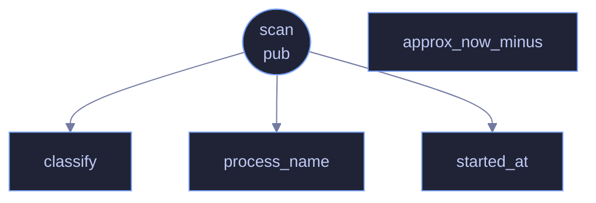

# `crates/veilvoice-watch/src/linux.rs`

[[veilvoice-watch|Crate-veilvoice-watch]] &middot; 192 lines &middot; [read the source](https://github.com/tilas01/veilvoice/blob/main/crates/veilvoice-watch/src/linux.rs)

## Contents

- [How it works](#how-it-works)
- [Sound servers](#sound-servers)
- [The permission boundary](#the-permission-boundary)
  - [What calls what](#what-calls-what)
  - [Items](#items)

Linux detection, via open file handles in `/proc`.

# How it works

A process using the microphone has a file descriptor open on an ALSA PCM
capture node — `/dev/snd/pcmC0D0c`, where the trailing `c` means capture as
opposed to `p` for playback. A process using the camera has one open on
`/dev/video*`. Walking `/proc/*/fd` and resolving the symlinks finds them,
along with the PID and the process name, with no dependency and no daemon.

Capture and playback are distinguished deliberately. Treating every open
`/dev/snd` handle as microphone use would report a music player as
listening to you, and a monitor that cries wolf gets ignored — which is the
worst possible outcome for this feature.

# Sound servers

On most desktops PipeWire or PulseAudio owns the hardware, so the process
holding the PCM node is the *server*, not the application behind it. That is
reported honestly rather than hidden: the server appearing means something
is capturing, and where the client can be identified from the ALSA
`/proc/asound` bookkeeping, it is named too.

# The permission boundary

`/proc/<pid>/fd` is readable only by the process owner and root. Without
root you therefore see your own processes; another user's are invisible.
That is a kernel boundary, not a gap in this code, and `crate::support`
says so rather than letting an empty list imply an empty machine.

## What calls what

## Items

| Item | Line | Documentation |
|---|---:|---|
| `scan` pub fn | [37](https://github.com/tilas01/veilvoice/blob/main/crates/veilvoice-watch/src/linux.rs#L37) |  |
| `classify` fn | [94](https://github.com/tilas01/veilvoice/blob/main/crates/veilvoice-watch/src/linux.rs#L94) | Decide whether an open handle means capture. |
| `process_name` fn | [115](https://github.com/tilas01/veilvoice/blob/main/crates/veilvoice-watch/src/linux.rs#L115) |  |
| `started_at` fn | [126](https://github.com/tilas01/veilvoice/blob/main/crates/veilvoice-watch/src/linux.rs#L126) | When the process started, from the modification time of its /proc entry. |
| `approx_now_minus` fn | [132](https://github.com/tilas01/veilvoice/blob/main/crates/veilvoice-watch/src/linux.rs#L132) | Unused today; kept because a future PipeWire client lookup will want it. |
