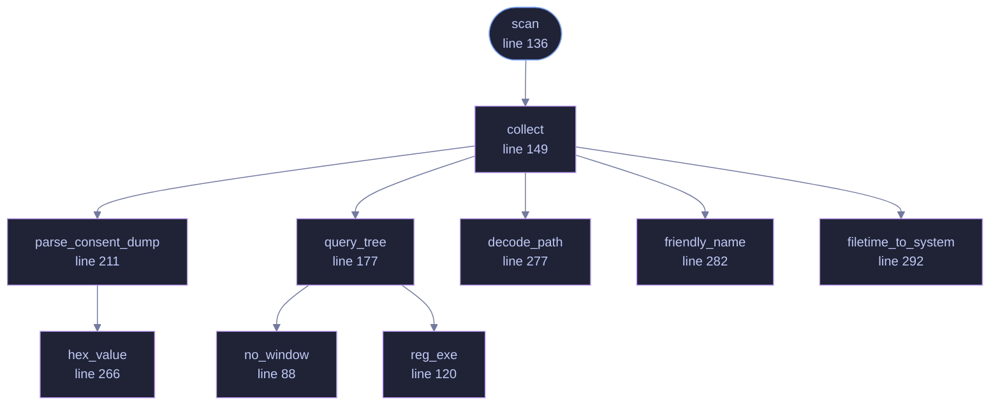

<!-- GENERATED by tools/docs/generate.py from the doc comments in the source. Do not edit: edit the .rs file and run the generator. -->

# `crates/veilvoice-watch/src/windows.rs`

[[veilvoice-watch|Crate-veilvoice-watch]] &middot; 606 lines &middot; [read the source](https://github.com/tilas01/veilvoice/blob/main/crates/veilvoice-watch/src/windows.rs)

## Contents

- [Where the answer lives](#where-the-answer-lives)
- [One subprocess per capability, and why that had to be fixed](#one-subprocess-per-capability-and-why-that-had-to-be-fixed)
- [What it cannot give you](#what-it-cannot-give-you)
- [In plain words](#in-plain-words)
  - [What calls what](#what-calls-what)
  - [Items](#items)

Windows detection, via the Capability Access Manager.

# Where the answer lives

Windows records every application's use of the microphone and camera under
`HKCU\SOFTWARE\Microsoft\Windows\CurrentVersion\CapabilityAccessManager\
ConsentStore\{microphone,webcam}`. Each application gets a subkey holding
`LastUsedTimeStart` and `LastUsedTimeStop` as FILETIME values.

The rule that makes this a *live* view rather than a history: an application
is using the device right now when its start time is non-zero and its stop
time is zero. Windows clears the stop value on acquisition and writes it on
release. This is the same bookkeeping that drives the taskbar privacy
indicator, so what this reports is exactly what the OS itself believes.

Desktop programs live under a `NonPackaged` subkey, with their path encoded
using `#` in place of each separator. Store apps appear directly, keyed by
package family name.

# One subprocess per capability, and why that had to be fixed

This originally asked `reg.exe` for the subkeys of the store, then spawned
`reg.exe` **twice more for every application it found** to read the two
timestamps. The count is `2 + 2n` per capability, where `n` is how many
applications have ever asked for that device.

Measured on the machine this was found on: 7 packaged and 19 desktop
applications for the microphone, 6 packaged for the camera — **68 process
creations per scan**. One `reg.exe` spawn there costs 6.6 ms at its
fastest, so a scan cost **at least 449 ms**, and that is the warm-cache best
case rather than the typical one. The desktop application called `scan` on
the user-interface thread every two seconds.

The result was a window that froze repeatedly, which is what "runs extremely
slow and freezes every couple of seconds" meant in the report. Nothing was
leaking and nothing was deadlocked: it was doing a great deal of work in the
worst possible place.

`reg query <key> /s` prints the **whole subtree**, keys and values together,
in one go. So the scan is now two spawns — one per capability — and
`parse_consent_dump` does the rest in memory. Measured on the same
machine: 45 ms for the whole scan, against 449 ms, and it no longer grows
with the number of applications installed. The parser is a pure function
over text, so it is tested against a captured dump on every platform rather
than only on the one that can produce it.

The front end was fixed too, and separately: a scan that is fast is still
not something to do on the thread that paints.

# What it cannot give you

A PID. Windows tracks this per *application*, not per process, so
`DeviceUse::pid` is `None` here. The trade is worth it: this sees packaged
apps, background services and anything else the OS accounts for, which
enumerating process handles would miss.

# In plain words

Finds out which applications are using the microphone or camera on Windows.

Windows keeps that in its own records of what has been granted access and when,
and this reads them. It reports per application rather than per running
program, because that is how Windows stores it, and the difference is stated
rather than papered over.

## What this file contains

606 lines defining **10 functions** (1 public), **0 types** and **2 constants**. Everything below is read out of the source, so it cannot disagree with the code.

**What happens when it runs.** These are the ways in: public, and nothing else in this file calls them, so they are what an outside caller reaches first.

- `scan` (line 136)
  - reaches: `collect`, `decode_path`, `filetime_to_system`, `friendly_name`, `parse_consent_dump`, `query_tree`, `hex_value`, `no_window`, `reg_exe`

## What calls what

_Colour key: **entry** -- a way in: public, and nothing in this file calls it; **helper** -- private to this file._

  

The same graph as Mermaid source

## Items

| Item | Line | Documentation |
|---|---:|---|
| `no_window` fn | [88](https://github.com/tilas01/veilvoice/blob/main/crates/veilvoice-watch/src/windows.rs#L88) | Spawn without a console window. |
| `CONSENT_STORE` const | [101](https://github.com/tilas01/veilvoice/blob/main/crates/veilvoice-watch/src/windows.rs#L101) | The full hive name, not the HKCU abbreviation: reg query echoes subkey paths back in long form, and the reply has to be matched against what was asked for. |
| `FILETIME_TO_UNIX_SECS` const | [105](https://github.com/tilas01/veilvoice/blob/main/crates/veilvoice-watch/src/windows.rs#L105) | FILETIME counts 100-nanosecond intervals from 1601-01-01; Unix time starts at 1970-01-01. |
| `reg_exe` fn | [120](https://github.com/tilas01/veilvoice/blob/main/crates/veilvoice-watch/src/windows.rs#L120) | The absolute path of reg.exe, or None if it is not where it should be. |
| `scan` pub fn | [136](https://github.com/tilas01/veilvoice/blob/main/crates/veilvoice-watch/src/windows.rs#L136) |  |
| `collect` fn | [149](https://github.com/tilas01/veilvoice/blob/main/crates/veilvoice-watch/src/windows.rs#L149) | Walk one capability's whole subtree, from a single reg query /s. |
| `query_tree` fn | [177](https://github.com/tilas01/veilvoice/blob/main/crates/veilvoice-watch/src/windows.rs#L177) | One reg query <key> /s, printing the whole subtree. |
| `parse_consent_dump` pub(crate) fn | [211](https://github.com/tilas01/veilvoice/blob/main/crates/veilvoice-watch/src/windows.rs#L211) | Pull (key, LastUsedTimeStart, LastUsedTimeStop) out of a /s dump. |
| `hex_value` fn | [266](https://github.com/tilas01/veilvoice/blob/main/crates/veilvoice-watch/src/windows.rs#L266) | Name    REG_QWORD    0x... |
| `decode_path` fn | [277](https://github.com/tilas01/veilvoice/blob/main/crates/veilvoice-watch/src/windows.rs#L277) | Registry keys encode a path with # where a separator belongs. |
| `friendly_name` fn | [282](https://github.com/tilas01/veilvoice/blob/main/crates/veilvoice-watch/src/windows.rs#L282) | The executable name, or the package family name for a Store app. |
| `filetime_to_system` fn | [292](https://github.com/tilas01/veilvoice/blob/main/crates/veilvoice-watch/src/windows.rs#L292) |  |
