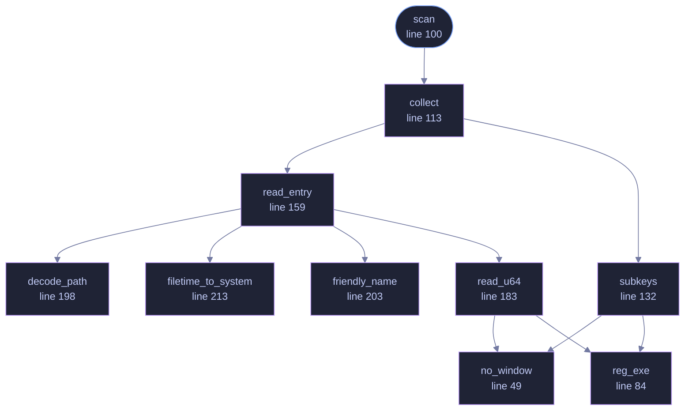

<!-- GENERATED by tools/docs/generate.py from the doc comments in the source. Do not edit: edit the .rs file and run the generator. -->

# `crates/veilvoice-watch/src/windows.rs`

[[veilvoice-watch|Crate-veilvoice-watch]] &middot; 416 lines &middot; [read the source](https://github.com/tilas01/veilvoice/blob/main/crates/veilvoice-watch/src/windows.rs)

## Contents

- [Where the answer lives](#where-the-answer-lives)
- [What it cannot give you](#what-it-cannot-give-you)
  - [What calls what](#what-calls-what)
  - [Items](#items)

Windows detection, via the Capability Access Manager.

# Where the answer lives

Windows records every application's use of the microphone and camera under
`HKCU\SOFTWARE\Microsoft\Windows\CurrentVersion\CapabilityAccessManager\
ConsentStore\{microphone,webcam}`. Each application gets a subkey holding
`LastUsedTimeStart` and `LastUsedTimeStop` as FILETIME values.

The rule that makes this a *live* view rather than a history: an application
is using the device right now when its start time is non-zero and its stop
time is zero. Windows clears the stop value on acquisition and writes it on
release. This is the same bookkeeping that drives the taskbar privacy
indicator, so what this reports is exactly what the OS itself believes.

Desktop programs live under a `NonPackaged` subkey, with their path encoded
using `#` in place of each separator. Store apps appear directly, keyed by
package family name.

# What it cannot give you

A PID. Windows tracks this per *application*, not per process, so
`DeviceUse::pid` is `None` here. The trade is worth it: this sees packaged
apps, background services and anything else the OS accounts for, which
enumerating process handles would miss.

## What this file contains

416 lines defining **10 functions** (1 public), **0 types** and **3 constants**. Everything below is read out of the source, so it cannot disagree with the code.

**What happens when it runs.** These are the ways in: public, and nothing else in this file calls them, so they are what an outside caller reaches first.

- `scan` (line 100)
  - reaches: `collect`, `read_entry`, `subkeys`, `decode_path`, `filetime_to_system`, `friendly_name`, `read_u64`, `no_window`, `reg_exe`

## What calls what

_Colour key: **entry** -- a way in: public, and nothing in this file calls it; **helper** -- private to this file._

## Items

| Item | Line | Documentation |
|---|---:|---|
| `no_window` fn | [49](https://github.com/tilas01/veilvoice/blob/main/crates/veilvoice-watch/src/windows.rs#L49) | Spawn without a console window. |
| `CONSENT_STORE` const | [62](https://github.com/tilas01/veilvoice/blob/main/crates/veilvoice-watch/src/windows.rs#L62) | The full hive name, not the HKCU abbreviation: reg query echoes subkey paths back in long form, and the reply has to be matched against what was asked for. |
| `FILETIME_TO_UNIX_SECS` const | [66](https://github.com/tilas01/veilvoice/blob/main/crates/veilvoice-watch/src/windows.rs#L66) | FILETIME counts 100-nanosecond intervals from 1601-01-01; Unix time starts at 1970-01-01. |
| `BACKSLASH` const | [69](https://github.com/tilas01/veilvoice/blob/main/crates/veilvoice-watch/src/windows.rs#L69) | The registry path separator, as a byte. |
| `reg_exe` fn | [84](https://github.com/tilas01/veilvoice/blob/main/crates/veilvoice-watch/src/windows.rs#L84) | The absolute path of reg.exe, or None if it is not where it should be. |
| `scan` pub fn | [100](https://github.com/tilas01/veilvoice/blob/main/crates/veilvoice-watch/src/windows.rs#L100) |  |
| `collect` fn | [113](https://github.com/tilas01/veilvoice/blob/main/crates/veilvoice-watch/src/windows.rs#L113) | Walk one capability's subkeys, two levels deep to catch NonPackaged. |
| `subkeys` fn | [132](https://github.com/tilas01/veilvoice/blob/main/crates/veilvoice-watch/src/windows.rs#L132) | Immediate subkey paths of key, or nothing if it does not exist. |
| `read_entry` fn | [159](https://github.com/tilas01/veilvoice/blob/main/crates/veilvoice-watch/src/windows.rs#L159) | Read one application's entry, returning it only if the device is in use now. |
| `read_u64` fn | [183](https://github.com/tilas01/veilvoice/blob/main/crates/veilvoice-watch/src/windows.rs#L183) |  |
| `decode_path` fn | [198](https://github.com/tilas01/veilvoice/blob/main/crates/veilvoice-watch/src/windows.rs#L198) | Registry keys encode a path with # where a separator belongs. |
| `friendly_name` fn | [203](https://github.com/tilas01/veilvoice/blob/main/crates/veilvoice-watch/src/windows.rs#L203) | The executable name, or the package family name for a Store app. |
| `filetime_to_system` fn | [213](https://github.com/tilas01/veilvoice/blob/main/crates/veilvoice-watch/src/windows.rs#L213) |  |
